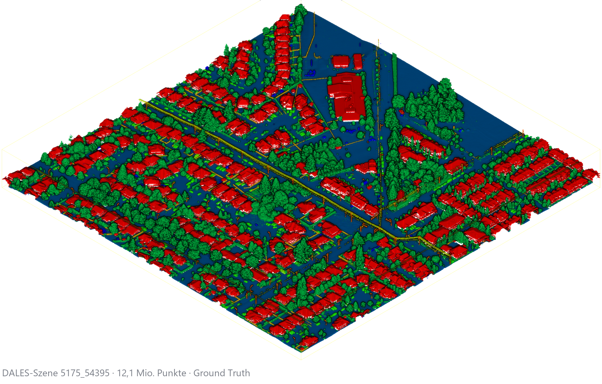

# Chunking ist Teil des Modells

**Semantische Segmentierung grosser ALS-Punktwolken mit Point Transformer V3** —
Masterarbeit, TU Berlin, Fachgebiet Skalierbare Softwaresysteme.

[**→ Live-Präsentation und Browser-Demo**](https://sechs130.github.io/pointcloud-chunking-thesis/)

[**Live Presentation**](apps/point-cloud-toolkit/index.html) ·
[**Interactive Demo**](apps/point-cloud-toolkit/demo.html) ·
[**Offline Download**](downloads/point-cloud-toolkit-presentation.zip) ·
[**Presentation PDF**](downloads/point-cloud-toolkit-presentation.pdf) ·
[**Project Overview**](#die-forschungsfrage)



## Die Forschungsfrage

> How do decomposition and recomposition strategies affect the accuracy and
> computational efficiency of transformer-based semantic segmentation for
> large-scale urban ALS point clouds?

Eine Szene des DALES-Datensatzes hat im Median **12,1 Millionen Punkte**. Ein
Transformer verarbeitet hier höchstens **45 000** davon auf einmal. Die Szene
muss also rund 270-mal zerlegt und danach wieder zusammengesetzt werden — und
genau diese Zerlegung ist keine Vorverarbeitungs-Fussnote, sondern Teil des
Modells.

## Das Ergebnis in einer Zahl

| | |
|---|---|
| **0,5552 mIoU** | beste getestete Konfiguration: k-d-Baum-Zerlegung mit `distance_confidence`-Merge |
| 0,2766 mIoU | schwächste Zerlegung (Morton) bei **identischem** Modell und Training |
| **Faktor 2** | Qualitätsunterschied, der allein aus der Zerlegungsstrategie kommt |

Sechs Zerlegungsstrategien × vier Merge-Regeln, 11 Testszenen, ein einziges
Trainingsrezept. Alle 24 Ergebniszellen wurden für diese Veröffentlichung aus
den 264 Metrik-Dateien neu berechnet.

## Architektur

```
LAS/PLY-Szene  →  Zerlegung  →  PTv3-Inferenz  →  Merge  →  Szenen-Metrik
   12,1 Mio.      45 000/Chunk    13-View-TTA     4 Regeln    mIoU, OA
```

Die Zerlegungs- und Merge-Schicht ist framework-unabhängig und als eigene,
getestete Python-Bibliothek herausgelöst. Training und Inferenz laufen in
Pointcept.

## Eigenanteil und Fremdanteil

| | |
|---|---|
| **Eigener Beitrag** | sechs Zerlegungsstrategien, vier Merge-Regeln, Chunk-Archivformat mit stabilen Punkt-IDs und SHA-256 je Chunk, Experimentsteuerung, Auswertung, RAM-Wächter, kNN-Backend-Vergleich, diese Präsentation und Demo |
| **Upstream** | [Pointcept](https://github.com/Pointcept/Pointcept) (Trainings- und Inferenz-Framework) und [Point Transformer V3](https://arxiv.org/abs/2312.10035). **Nicht** mein Werk und hier auch nicht mitgeliefert. |
| **Datensatz** | [DALES](https://udayton.edu/engineering/research/centers/vision_lab/research/was_data_analysis_and_processing/dale.php) — Airborne Laser Scanning, 40 Szenen, 505 Mio. Punkte |

## Was diese Seite zeigt

- **Präsentation** — 13 Hauptfolien, 6 Backup-Folien, Sprechernotizen (Taste `S`),
  vollständig offline, ohne CDN, ohne externe Schrift.
- **Browser-Demo** — zerlegt eine kleine Punktwolke wirklich im Browser:
  `xy`, `morton` und `bisect_xy_overlap`, stabile Punkt-IDs, Redundanzmetrik,
  punktgenaue Rekonstruktion. Nichts wird hochgeladen.

Die Browser-Demo ist eine **Portierung** von drei der sechs Strategien aus der
kanonischen Python-Bibliothek. Sie ist als solche gekennzeichnet und wird bei
jedem Build gegen die Python-Referenz geprüft (11 Vergleichsfälle, Chunk für
Chunk identisch). `kdtree`, `rand_knn` und `rand_cyl` brauchen eine
Nachbarschaftssuche und laufen nur in der Vollversion.

## Für technische Leser

```
apps/point-cloud-toolkit/index.html      Präsentation (Asciidoctor Reveal.js)
apps/point-cloud-toolkit/demo.html       Browser-Demo
apps/point-cloud-toolkit/browser-core.js Portierung der drei Strategien (kommentiert)
apps/point-cloud-toolkit/presentation/   Grafiken, Diagramme, reveal.js — alles lokal
```

Was hier **nicht** liegt, und warum: Rohpunktwolken und Modellgewichte (Grösse
und Datenherkunft), Trainingslogs und Thesis-Quelltext (nicht
veröffentlichungsreif), Pointcept-Quellcode (fremdes Werk, siehe Upstream-Link),
das Flask-Backend und die übrigen Portfolio-Apps (privates
Entwicklungs-Repository).

Die Präsentation und die Auswertung sind vollständig reproduzierbar: `.adoc` als
Quelle, Asciidoctor Reveal.js als Build, jede Grafik aus einem Skript, das die
Rohdaten liest. Wer Details zur Methode, zum Versuchsaufbau oder zur
Vollversion braucht, erreicht mich über mein GitHub-Profil.

---

*Statischer Build. Erzeugt mit `node tools/dist.mjs` aus dem privaten
Entwicklungs-Repository; 78 Dateien, 13.4 MB, keine externe Laufzeitabhängigkeit.*
